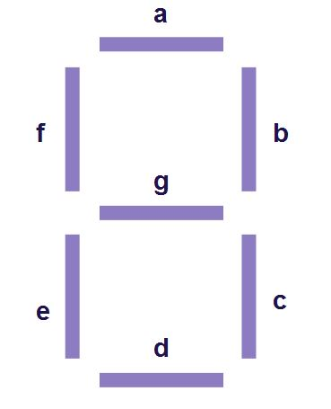

# Converção de binário para 7 segmentos

Este projeto tem por objetivo realizar a converção de um número binário, recebido como um *char de 8 bits* (só são utilizados os 4 bits menos significativos) para um *char 8 bits* que representa o estados dos segmentos do display da seguinte ordem: 0gfedcba

## Segue a seguinte definição de segmentos

